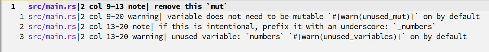
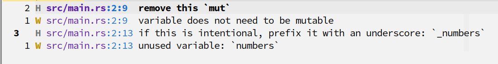

# Pretty Quickfix windows for NeoVim

nvim-pqf makes your quickfix and location list windows look nicer, thanks to a
combination of a custom `quickfixtextfunc` function and custom syntax rules for
quickfix/location list buffers.

Without nvim-pqf, your quickfix window looks like this:



With nvim-pqf, it looks like this (colours depend on your theme of course);



## Features

- Better highlights for line and column numbers
- Highlights for the item type (error, warning, etc)
- Item types use the same signs as NeoVim's diagnostic signs
- File paths are aligned so messages always start at the same column, making
  them easier to read
- Works for both quickfix and location list windows
- Items only display the first line in case they contain multiple lines

## Requirements

NeoVim 0.5 or newer is required. Regular Vim isn't supported.

## Installation

First install this plugin using your plugin manager of choice. For example, when
using vim-plug use the following:

    Plug 'https://gitlab.com/yorickpeterse/nvim-pqf.git'

Once installed, add the following Lua snippet to your `init.lua`:

    require('pqf').setup()

And that's it!

## Configuring signs

Each item in the quickfix list starts with a sign that indicates the type of
item, if this information is available. For example, when displaying diagnostics
an item may start with `E` for an error, and `W` for a warning.

These signs are taken from the `text` attribute of NeoVim's diagnostic signs.
Refer to `:h diagnostic-signs` for more information, and details on how to
override these signs.

If you want the quickfix window to use its own signs, you can configure them
like so:

```lua
require('pqf').setup({
  signs = {
    error = 'E',
    warning = 'W',
    info = 'I',
    hint = 'H'
  }
})
```

## Tweaking the highlights

Depending on your theme, you may need to tweak the highlights used by nvim-pqf.
The following highlight groups are defined:

| Group        | Links to          | Use
|:-------------|:------------------|:-----------------------------------
| `qfPath`     | `Directory`       | The file path of a quickfix item
| `qfPosition` | `Number`          | Line and column numbers
| `qfError`    | `DiagnosticError` | The indicator of error items
| `qfWarning`  | `DiagnosticWarn`  | The indicator of warning items
| `qfInfo`     | `DiagnosticInfo`  | The indicator of info items
| `qfHint`     | `DiagnosticHint`  | The indicator of hint items

It's probably best to tweak the diagnostic highlights, instead of the quickfix
ones.

## License

All source code in this repository is licensed under the Mozilla Public License
version 2.0, unless stated otherwise. A copy of this license can be found in the
file "LICENSE".
